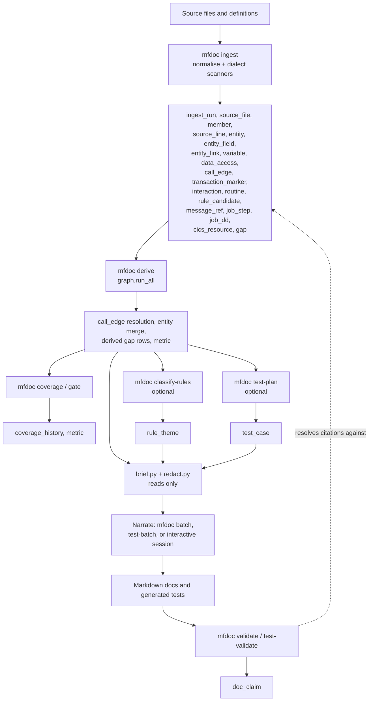
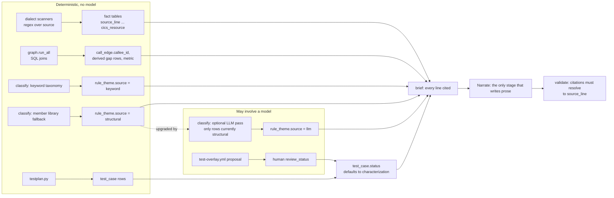

# The fact store: how the SQLite database hangs together

`mfdoc` keeps everything it learns about a legacy codebase in one SQLite file,
`.mfdoc/index.db` by default (`options.index_db` in `project.yml`). This guide
explains what that file is for, which pipeline stage writes which table, which
parts are deterministic and which can involve a model, and how a row ends up
as a cited sentence in a generated document or test.

The schema's source of truth is the `SCHEMA` string in
[`src/mfdoc/db.py`](../../src/mfdoc/db.py). If this guide and that file ever
disagree, `db.py` wins; please fix the guide. For the stage-by-stage pipeline
narrative see [architecture.md](architecture.md); for the data-handling
implications of the file see
[security-and-compliance.md](security-and-compliance.md).

All names in the examples below (`FIELD_A`, `#FLAG_A`, `MEMBER_A`, ...) are
synthetic placeholders, not names from any real system.

## What "deterministic fact store" means

The pipeline is split on purpose into a part that only ever extracts facts and
a part that writes prose.

- **Extraction and derivation are deterministic.** `mfdoc ingest` and
  `mfdoc derive` are plain Python (regex scanners plus SQL joins). They make no
  model calls, so running them twice on the same input gives the same rows. A
  line the scanners cannot understand is recorded as a `gap` row rather than
  skipped or guessed.
- **Narration is the only prose stage, and it only reads the store.** A model
  never sees raw source. It sees a *brief* assembled from the store in which
  every line already carries a `[[MEMBER:LINE]]` citation, and the validator
  later resolves each citation back to a `source_line` row.
- **The store is rebuildable.** It is gitignored; nothing is hand-edited into
  it, and deleting it costs a re-run, not data.
- **It is sensitive.** `source_line.text` holds every ingested line
  unredacted. Redaction happens later, when briefs are generated.

A few tables are exceptions to "pure extraction": `rule_theme` may hold an
LLM-assigned theme, `test_case.status` may carry a human-reviewed
bug-versus-spec status that originated in an LLM-proposed overlay file, and
`metric`/`coverage_history` hold measurements about the store. Those are
called out in the provenance section below.

## Pipeline stages and the tables they touch

The diagram groups tables by the stage that *creates* them. Several later
stages also update or delete rows from earlier tables; the precise write map
is in the next section.

### Which stage writes which table

| Stage (command) | Module | Writes | Reads | Model calls |
| --- | --- | --- | --- | --- |
| Ingest (`mfdoc ingest`) | `cli.py`, `normalise.py`, `dialects/*.py` | `ingest_run`, `source_file`, `member`, `source_line`, `entity`, `entity_field`, `entity_link`, `variable`, `data_access`, `call_edge`, `transaction_marker`, `interaction`, `routine`, `rule_candidate`, `message_ref`, `job_step`, `job_dd`, `cics_resource`, `gap` (kinds such as `unparsed_line`, `dynamic_target`, `external_call`, `undefined_entity`, `ambiguous_dialect`, `source_too_large`) | the source files themselves, `source_file` for incremental-ingest cache checks | None |
| Derive (`mfdoc derive`) | `graph.py` (`run_all`) | updates `call_edge` (resolves `callee_id`), merges duplicate `entity` rows, deletes then re-inserts derived `gap` kinds, `metric` (`coverage.*` and `derived.*` names) | nearly every fact table | None |
| Coverage / gate (`mfdoc coverage`, `mfdoc gate`) | `cli.py`, `graph.coverage` | `coverage_history` (append-only), `metric` | fact tables, `metric` | None |
| Citation sampling (`mfdoc sample-citations`) | `sample.py`, `cli.py` | `metric` (`citation_accuracy_rate`) | generated docs, `source_line` | None (verdicts are human) |
| Classify (`mfdoc classify-rules`) | `classify.py` | `rule_theme` | `rule_candidate`, `member` | Optional LLM pass, off unless enabled |
| Test plan (`mfdoc test-plan`) | `testplan.py` | `test_case` | `rule_candidate`, `variable`, `data_access`, `call_edge` | None |
| Test advisory (`mfdoc test-advisory`) | `testadvisor.py` | `gap` rows of kind `sme_question` (re-created via `transaction_scopes`, as derive does) | `rule_candidate`, `data_access`, `call_edge` | None |
| Brief (`mfdoc brief`, and inside `batch`) | `brief.py`, `redact.py` | nothing | all fact tables | None |
| Narrate (`mfdoc batch`, `test-batch`, interactive) | `batch.py`, `testbatch.py`, `SKILL.md` | nothing in the store (writes Markdown and state files) | the brief text only | Yes, from the brief |
| Validate (`mfdoc validate`, `test-validate`) | `validate.py`, `testbatch.py` | `doc_claim` | generated docs, `source_line`, `test_case` | None |
| Doc drift, export, structural renderers | `docdrift.py`, `structural.py`, `brief.py` | nothing | fact tables | None |

Test overlays (`mfdoc test-overlay-draft`) are the one place a model can
*propose* a scenario status, but it writes to `test-overlay.yml`, not to the
database. `mfdoc test-plan` then copies a status into `test_case.status` only
from an overlay entry a human has reviewed; with no entry it defaults to
`characterization`.

## Entity-relationship diagram

Foreign keys are declared in `db.py` and enforced (`PRAGMA foreign_keys = ON`).
A few tables have no foreign keys at all (`metric`, `coverage_history`,
`doc_claim`); they refer to members only by name or not at all.

```mermaid
erDiagram
    ingest_run ||--o{ source_file : "ingest_run_id"
    source_file ||--o{ member : "source_file_id"
    member ||--o{ source_line : "member_id"
    member ||--o{ variable : "member_id"
    member ||--o{ data_access : "member_id"
    member ||--o{ call_edge : "caller_id"
    member |o--o{ call_edge : "callee_id"
    member ||--o{ transaction_marker : "member_id"
    member ||--o{ interaction : "member_id"
    member ||--o{ routine : "member_id"
    member ||--o{ rule_candidate : "member_id"
    member ||--o{ message_ref : "member_id"
    member ||--o{ job_step : "member_id"
    member ||--o{ job_dd : "member_id"
    member ||--o{ cics_resource : "member_id"
    member |o--o{ gap : "member_id"
    member ||--o{ test_case : "member_id"
    member |o--o{ entity : "defined_in"
    member |o--o{ entity_link : "via_member"
    entity ||--o{ entity_field : "entity_id"
    entity ||--o{ entity_link : "from_entity"
    entity ||--o{ entity_link : "to_entity"
    entity |o--o{ data_access : "entity_id"
    rule_candidate ||--o| rule_theme : "rule_candidate_id UNIQUE"
    rule_candidate |o--o{ test_case : "rule_candidate_id"

    ingest_run {
        int id PK
        text started_at
        text tool_version
        text config_json
    }
    source_file {
        int id PK
        text path UK
        text sha256
        text dialect_hash
        int ingest_run_id FK
    }
    member {
        int id PK
        text name
        text dialect
        text library
        int source_file_id FK
    }
    source_line {
        int member_id PK, FK
        int line_no PK
        text text
        int is_comment
    }
    entity {
        int id PK
        text name
        text kind
        int defined_in FK
    }
    entity_field {
        int id PK
        int entity_id FK
        text name
        int is_descriptor
    }
    entity_link {
        int id PK
        int from_entity FK
        int to_entity FK
        text link_kind
        int via_member FK
    }
    variable {
        int id PK
        int member_id FK
        text scope
        text name
        int line_no
    }
    data_access {
        int id PK
        int member_id FK
        int line_no
        text verb
        text crud
        text entity_name
        int entity_id FK
    }
    call_edge {
        int id PK
        int caller_id FK
        text callee_name
        int callee_id FK
        text call_kind
        int resolved
    }
    transaction_marker {
        int id PK
        int member_id FK
        int line_no
        text marker
    }
    interaction {
        int id PK
        int member_id FK
        text kind
        text target
    }
    routine {
        int id PK
        int member_id FK
        text name
        int start_line
        int end_line
    }
    rule_candidate {
        int id PK
        int member_id FK
        int line_no
        int end_line
        text construct
        text confidence
    }
    rule_theme {
        int id PK
        int rule_candidate_id FK, UK
        text theme
        text source
    }
    message_ref {
        int id PK
        int member_id FK
        text kind
    }
    job_step {
        int id PK
        int member_id FK
        text step_name
        text program
    }
    job_dd {
        int id PK
        int member_id FK
        text dd_name
        text dsn
    }
    cics_resource {
        int id PK
        int member_id FK
        text resource_type
        text resource_name
    }
    gap {
        int id PK
        int member_id FK
        text gap_kind
        text severity
    }
    test_case {
        int id PK
        int member_id FK
        int rule_candidate_id FK
        text scenario_name
        text status
        text citation
    }
    metric {
        int id PK
        text scope
        text name
        text value
    }
    coverage_history {
        int id PK
        text recorded_at
        text source
        text metrics_json
    }
    doc_claim {
        int id PK
        text doc_path
        text citation
        text member_name
        int valid
    }
```

### How to read it

- **`member` is the hub.** One `source_file` can hold many members (an unload
  or library export), and almost every per-line fact table hangs off
  `member_id`. A member is unique by `(name, library, dialect)`, so a bare name
  is *not* a unique key. `db.resolve_member_by_name` refuses to guess when two
  libraries share a name.
- **`(member_id, line_no)` is the citation address.** `source_line`'s composite
  primary key is exactly what a `[[MEMBER_A:42]]` citation resolves to. Every
  fact table that carries `line_no` points back into it by convention (it is
  not a declared foreign key). A line that never makes it into `source_line`
  can never be cited.
- **Two kinds of "entity".** `entity` is a data store (a file, table, dataset,
  queue); `entity_field` is its columns or elements; `entity_link` joins two
  entities (coupling, linkpath, foreign key, "implements"). `data_access`
  connects code to data: `entity_name` is the name as written in source, and
  `entity_id` is filled in only when derive could resolve it.
- **`call_edge` resolves late.** Ingest records `callee_name` and
  `resolved = 0`; derive fills `callee_id` when it finds a member with that
  name (compared case-insensitively) and sets `resolved = 1`. Unresolved edges
  become `unresolved_call` gaps.
- **Soft references.** `data_access.key_source_line`,
  `rule_candidate.pair_line_no`, `rule_candidate.end_line`,
  `data_access.end_line` and `routine.start_line`/`end_line` are line numbers
  inside the same member, not foreign keys. `doc_claim.member_name` is a name,
  not an id.

## Provenance: deterministic versus LLM-derived

Concretely:

- **`rule_theme.source`** records how a rule's theme was chosen. `classify.py`
  runs a project taxonomy (regexes over the rule's condition and literals) first
  and writes `keyword` on a match. Anything unmatched falls back to the
  member's library, written as `structural`. If the optional LLM pass is
  enabled it then re-examines only rows whose `source` is `structural`, and a
  theme it accepts is written as `llm` via an `UPDATE`. Every rule ends up with
  a theme, and `source` tells a reader how much to trust it. The table is
  `UNIQUE(rule_candidate_id)`, so re-classifying is an upsert rather than a
  growing history.
- **`rule_candidate.confidence`** is `verified` by default. `inferred` marks
  structure read from indentation instead of an explicit `END-*` keyword, and
  `low` marks assignments whose right-hand side has no literal that the
  scanners would normally decline to capture. The same
  `verified | inferred | low` idea appears on `data_access`, `entity_link`,
  `routine` and `test_case`, so a brief can hedge accordingly.
- **`test_case`** rows are wholly derived and rebuilt on each `mfdoc test-plan`
  run. The "then" side is a cited source excerpt, never a guessed expected
  value.
- **`gap`** is the deterministic pass's list of things it could not resolve,
  and is the seed of the SME interview agenda. A few kinds are cleared and
  regenerated on every derive (`graph.DERIVED_GAP_KINDS`); the rest are written
  at ingest and owned by their member.

## Worked example of a fact flowing to a document

Suppose a synthetic member `MEMBER_A` contains, at line 42, a conditional on
`#FLAG_A`.

1. **Ingest** inserts the raw line into `source_line (member_id, 42, text)`, and
   a `rule_candidate` row with `line_no = 42`, `construct = 'IF'`,
   `condition` and `fields_used` mentioning `#FLAG_A`. If the `IF` has a
   matching `END-IF`, `end_line` is filled in.
2. **Derive** leaves that row alone but may add derived gaps or update
   `metric` rows such as `coverage.*`.
3. **Classify** (optional) writes a `rule_theme` row, for example
   `theme = 'status'`, `source = 'keyword'`.
4. **Brief** generation selects those rows, renders a line such as
   `MEMBER_A:42  IF #FLAG_A = ...` and runs the redactor over it.
5. **Narrate** writes a sentence ending in `[[MEMBER_A:42]]`.
6. **Validate** resolves `MEMBER_A:42` back to `source_line` and records the
   outcome in `doc_claim (citation, member_name, line_from, valid)`.
7. **Test plan** (optional) turns the same `rule_candidate` into a `test_case`
   whose `citation` is `MEMBER_A:42`, and `test-validate` checks a generated
   test file's `MEMBER:BR-nnn` references against those rows.

## Schema object inventory

The schema contains **23 tables**, **0 views**, **0 triggers**, **0 virtual
(FTS) tables**, **17 explicitly created indexes** (14 plain, 3 expression
indexes) and **5 implicit indexes** SQLite creates for `UNIQUE`/composite
primary key constraints. There is no separate migration table; see
[Schema evolution](#schema-evolution).

### Tables

| Table | Purpose | Key columns and relationships | Written by |
| --- | --- | --- | --- |
| `ingest_run` | One row per `mfdoc ingest` invocation; tool version and the full config used. The audit trail. | `id` PK. Referenced by `source_file.ingest_run_id`. | ingest |
| `source_file` | A file as ingested, with content hash for incremental ingest. | `id` PK; `path` UNIQUE; `sha256`, `dialect_hash` (together the cache key); `ingest_run_id` FK. | ingest |
| `member` | One logical legacy object (program, map, copycode, job, ...). The hub table. | `id` PK; UNIQUE `(name, library, dialect)`; `source_file_id` FK; `first_line`, `last_line`, `mode`. | ingest |
| `source_line` | Every ingested line, with 1-based `line_no` that citations use. | PK `(member_id, line_no)`; `member_id` FK; `text`, `is_comment`, `seq`. | ingest |
| `entity` | A data store: Adabas file, DDM, Supra dataset, SQL table, VSAM, workfile, queue. | `id` PK; UNIQUE `(name, kind)`; `defined_in` FK to `member`. | ingest, derive (merges duplicates) |
| `entity_field` | Fields or elements of an entity, including descriptor and key info. | `id` PK; `entity_id` FK; `is_descriptor`, `descriptor_kind`, `parent_fields`. | ingest |
| `entity_link` | Relationship between two entities (`implements`, `coupled`, `linkpath`, `foreign_key`, `joined_in_code`). | `id` PK; `from_entity`, `to_entity` FK to `entity`; `via_member` FK to `member`. | ingest |
| `variable` | Variables declared in a module, with scope. | `id` PK; `member_id` FK; `scope`, `name`, `line_no`. | ingest |
| `data_access` | Every data-access statement; the backbone of the CRUD matrix. | `id` PK; `member_id` FK; `verb`, `crud`; `entity_name` (as written) and `entity_id` FK (resolved); `key_source_line`/`key_source_expr`, `end_line`. | ingest |
| `call_edge` | Call-graph edges between members. | `id` PK; `caller_id` FK; `callee_name` plus `callee_id` FK (NULL until resolved); `call_kind`, `dynamic`, `resolved`. | ingest, derive |
| `transaction_marker` | Commit, backout, syncpoint boundaries, for honest unit-of-work descriptions. | `id` PK; `member_id` FK; `marker`. | ingest |
| `interaction` | Screen, map and terminal I/O points. | `id` PK; `member_id` FK; `kind`, `target`, `dynamic`. | ingest |
| `routine` | Internal subroutine or entry boundaries within a member. A line outside every routine's `[start_line, end_line]` belongs to the main body. | `id` PK; `member_id` FK; `start_line`, `end_line` (NULL if no closer found). | ingest |
| `rule_candidate` | Candidate business rules: conditionals, loops, validations, computations. | `id` PK; `member_id` FK; `line_no`, `end_line`, `pair_line_no`; `construct`, `condition`, `confidence`. | ingest |
| `rule_theme` | Business theme assigned to a rule, for the thematic rules register. | `id` PK; `rule_candidate_id` FK, UNIQUE; `theme`; `source` = `keyword` or `llm` or `structural`. | classify-rules |
| `message_ref` | Error and message handling points. | `id` PK; `member_id` FK; `kind`, `number`, `text`. | ingest |
| `job_step` | JCL job steps. | `id` PK; `member_id` FK; `step_name`, `program`. | ingest |
| `job_dd` | JCL DD statements. | `id` PK; `member_id` FK; `step_name`, `dd_name`, `dsn`. | ingest |
| `cics_resource` | CICS resource definitions. | `id` PK; `member_id` FK; `resource_type`, `resource_name`. | ingest |
| `gap` | Everything the deterministic pass could not resolve; the SME agenda. | `id` PK; `member_id` FK (nullable, global gaps have none); `gap_kind`, `severity`, `detail`. | ingest, derive, test-advisory |
| `metric` | Current value of a named measurement. Overwritten in place by `set_metric`. | `id` PK; `(scope, name)` is unique by convention (delete-then-insert), not by constraint. | derive, coverage, sample-citations |
| `coverage_history` | Append-only snapshot per `coverage`/`gate` run, for trend reporting. | `id` PK; `recorded_at`, `source` = `coverage` or `gate`; `metrics_json`. No foreign keys. | coverage, gate |
| `test_case` | One derived test scenario (Given/When/Then, cited). Rebuilt on every `test-plan`. | `id` PK; `member_id` FK; `rule_candidate_id` FK (nullable); `scenario_name`, `status`, `citation`. | test-plan |
| `doc_claim` | Per-document record of each citation found in a generated document and whether it resolved. | `id` PK; `doc_path`, `citation`, `member_name`, `line_from`, `line_to`, `valid`. No foreign keys. | validate, test-validate |

### Indexes

| Index | On | Why it exists |
| --- | --- | --- |
| `ix_member_dialect` | `member(dialect)` | Filter members by dialect. |
| `ix_member_upper_name` | `member(UPPER(name))` (expression) | Case-insensitive callee/name lookup in `graph.resolve` and `orphans`; only used when the query writes the identical `UPPER(...)`. |
| `ix_entity_upper_name` | `entity(UPPER(name))` (expression) | Case-insensitive entity lookup in `resolve_entity` and `graph.resolve`. |
| `ix_field_entity` | `entity_field(entity_id)` | Fields of an entity. |
| `ix_var_member` | `variable(member_id)` | Variables of a member. |
| `ix_access_member` | `data_access(member_id)` | Accesses of a member. |
| `ix_access_entity` | `data_access(entity_name)` | CRUD matrix by entity. |
| `ix_call_caller` | `call_edge(caller_id)` | Outgoing edges. |
| `ix_call_edge_upper_callee` | `call_edge(UPPER(callee_name))` (expression) | Name-based resolution and orphan detection. |
| `ix_call_edge_callee_id` | `call_edge(callee_id)` | Lets SQLite use a multi-index OR plan in `orphans()` instead of scanning `call_edge` per candidate. |
| `ix_interaction_member` | `interaction(member_id)` | Interactions of a member. |
| `ix_routine_member` | `routine(member_id)` | Routines of a member. |
| `ix_rule_member` | `rule_candidate(member_id)` | Rules of a member. |
| `ix_rule_theme_theme` | `rule_theme(theme)` | Grouping for the thematic register. |
| `ix_gap_kind` | `gap(gap_kind)` | Gap listings and derived-gap purge by kind. |
| `ix_coverage_history_recorded_at` | `coverage_history(recorded_at)` | Time-ordered trend queries. |
| `ix_testcase_member` | `test_case(member_id)` | Scenarios of a member. |

Implicit indexes created by constraints, named `sqlite_autoindex_<table>_<n>`:

| Implicit index | Constraint |
| --- | --- |
| `sqlite_autoindex_source_file_1` | `source_file.path UNIQUE` |
| `sqlite_autoindex_member_1` | `member UNIQUE(name, library, dialect)` |
| `sqlite_autoindex_source_line_1` | `source_line PRIMARY KEY (member_id, line_no)` |
| `sqlite_autoindex_entity_1` | `entity UNIQUE(name, kind)` |
| `sqlite_autoindex_rule_theme_1` | `rule_theme UNIQUE(rule_candidate_id)` |

### Other schema-level objects

| Object | What it does |
| --- | --- |
| `PRAGMA journal_mode = WAL` | Write-ahead logging, set on every `connect()`. |
| `PRAGMA foreign_keys = ON` | Enforces the declared foreign keys. This is why `purge_member_facts` must delete `test_case` before `rule_candidate`. |
| `_COLUMN_MIGRATIONS` (in `db.py`) | List of columns added after a table first shipped; applied by `_apply_column_migrations`. |
| Views, triggers, FTS or other virtual tables | None exist. |
| Schema version | None is stored; `PRAGMA user_version` stays at its default of 0. |

## Schema evolution

There is no version number and no migration table. `db.connect()` does two
things every time it opens the file:

1. Runs the whole `SCHEMA` script. Every statement is `CREATE ... IF NOT
   EXISTS`, so a missing table or index is created and an existing one is left
   alone. This is enough for a brand-new table.
2. Calls `_apply_column_migrations`, which walks `_COLUMN_MIGRATIONS` and, for
   each `(table, column, type)`, issues `ALTER TABLE ... ADD COLUMN` if
   `PRAGMA table_info` shows the column is missing. This covers a column added
   to an existing table, which `CREATE TABLE IF NOT EXISTS` would never add.

The six column migrations currently registered are `rule_candidate.pair_line_no`,
`data_access.key_source_line`, `data_access.key_source_expr`,
`data_access.end_line`, `interaction.dynamic` and `source_file.dialect_hash`.
`tests/test_db_migrations.py` guards this by building a pre-migration database
shape, opening it with `connect()`, and asserting the new columns exist, can be
inserted into, and back-fill existing rows with the column default.

When you add a column to an existing table, add it to both `SCHEMA` and
`_COLUMN_MIGRATIONS`. Renaming, dropping or retyping a column, adding a
`NOT NULL` column without a default, and changing a constraint are *not*
handled; the supported answer is to delete `index.db` and re-run `mfdoc
ingest`, since the store is rebuildable.

## Lifecycle: re-ingest, purge and derive

- **Incremental ingest.** A source file is re-extracted only when its `sha256`
  or the hash of its dialect parser code (`source_file.dialect_hash`) changed.
  A parser change therefore invalidates every file of that dialect even with
  unchanged source.
- **Member-owned rows are replaced, not accumulated.** `purge_member_facts`
  deletes a member's `source_line`, `variable`, `data_access`,
  `transaction_marker`, `interaction`, `test_case`, `rule_candidate`,
  `message_ref`, `job_step`, `job_dd`, `cics_resource`, its `gap` rows and
  outgoing `call_edge` rows, plus `rule_theme` rows for its rules, but keeps the
  `member` row so cross-references from other members stay valid.
- **A member that stops existing.** `purge_member` additionally nulls
  `call_edge.callee_id` (and resets `resolved`), `entity.defined_in` and
  `entity_link.via_member` on *other* rows rather than deleting them, then
  deletes the member. The next `mfdoc derive` re-resolves them.
- **Derive starts from a clean slate** for derived gap kinds
  (`ambiguous_adabas_file`, `no_ddl_for_entity`, `unresolved_call`,
  `orphan_module`, `sme_question`, `unused_field`, `shadowed_assignment`,
  `label_control_mismatch`) so stale findings never survive a re-run.
- **History is append-only only where stated.** `ingest_run` and
  `coverage_history` accumulate; `metric` is overwritten in place;
  `test_case` is rebuilt; `rule_theme` is upserted.

## Querying it safely

You can open the file with any SQLite client. Because it holds unredacted
source, treat it like the source itself. For read-only inspection, open it
with `file:path/to/index.db?mode=ro` (URI mode) so nothing can be changed by
accident. Two reminders when writing queries:

- Compare names case-insensitively with `UPPER(name)` to hit the expression
  indexes, and remember a bare member name can match several libraries.
- Order gaps by `db.GAP_SEVERITY_ORDER_SQL`, not `ORDER BY severity DESC`;
  `severity` is text, so a plain sort puts `medium` ahead of `low` and `high`.
