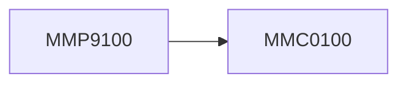

# Call graph — MILLPROD-1

```mermaid
graph LR
    n_MILLPROD_MMP9100_natural_32c783["MMP9100"]
    n_MILLPROD_MMC0100_natural_50939d["MMC0100"]
    n_MILLPROD_MMP9100_natural_32c783 --> n_MILLPROD_MMC0100_natural_50939d
```
