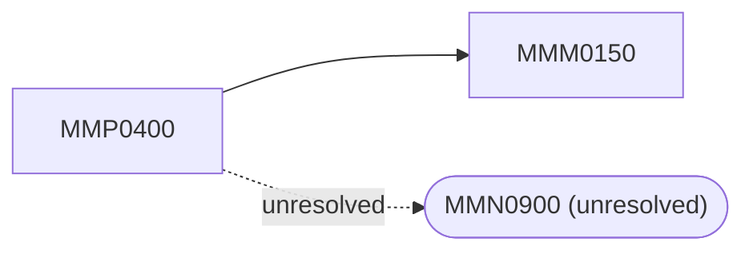

# Call graph — MILLPROD-2

```mermaid
graph LR
    n_MILLPROD_MMP0400_natural_297f3b["MMP0400"]
    n_MILLPROD_MMM0150_natural_84fcec["MMM0150"]
    n_MILLPROD_MMP0400_natural_297f3b --> n_MILLPROD_MMM0150_natural_84fcec
    n_MMN0900_91c85d(["MMN0900 (unresolved)"])
    n_MILLPROD_MMP0400_natural_297f3b -.->|unresolved| n_MMN0900_91c85d
```
