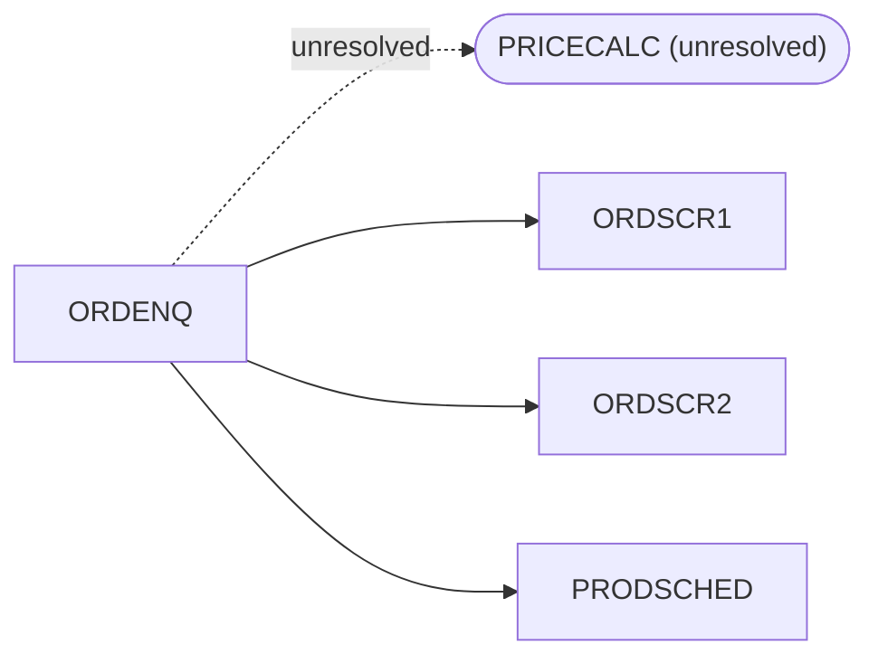

# Call graph — STEELLIB-6

```mermaid
graph LR
    n_STEELLIB_ORDENQ_mantis_a7879c["ORDENQ"]
    n_PRICECALC_388507(["PRICECALC (unresolved)"])
    n_STEELLIB_ORDENQ_mantis_a7879c -.->|unresolved| n_PRICECALC_388507
    n_STEELLIB_ORDSCR1_mantis_screen_960da3["ORDSCR1"]
    n_STEELLIB_ORDENQ_mantis_a7879c --> n_STEELLIB_ORDSCR1_mantis_screen_960da3
    n_STEELLIB_ORDSCR2_mantis_screen_60eaf1["ORDSCR2"]
    n_STEELLIB_ORDENQ_mantis_a7879c --> n_STEELLIB_ORDSCR2_mantis_screen_60eaf1
    n_STEELLIB_PRODSCHED_mantis_4c9376["PRODSCHED"]
    n_STEELLIB_ORDENQ_mantis_a7879c --> n_STEELLIB_PRODSCHED_mantis_4c9376
```
