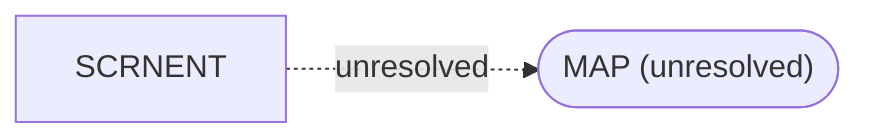

# Call graph — STEELLIB-7

```mermaid
graph LR
    n_STEELLIB_SCRNENT_mantis_38c50a["SCRNENT"]
    n_MAP_5af1a3(["MAP (unresolved)"])
    n_STEELLIB_SCRNENT_mantis_38c50a -.->|unresolved| n_MAP_5af1a3
```
