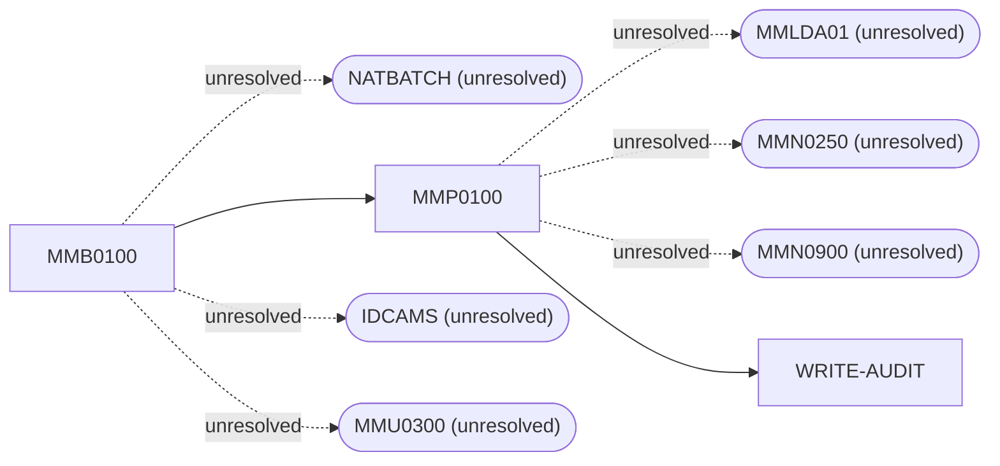

# Call graph — component-3

```mermaid
graph LR
    n_unknown_MMB0100_jcl_92d85c["MMB0100"]
    n_NATBATCH_1ec14e(["NATBATCH (unresolved)"])
    n_unknown_MMB0100_jcl_92d85c -.->|unresolved| n_NATBATCH_1ec14e
    n_MILLPROD_MMP0100_natural_6fdf53["MMP0100"]
    n_unknown_MMB0100_jcl_92d85c --> n_MILLPROD_MMP0100_natural_6fdf53
    n_IDCAMS_143221(["IDCAMS (unresolved)"])
    n_unknown_MMB0100_jcl_92d85c -.->|unresolved| n_IDCAMS_143221
    n_MMU0300_5a0cc4(["MMU0300 (unresolved)"])
    n_unknown_MMB0100_jcl_92d85c -.->|unresolved| n_MMU0300_5a0cc4
    n_MMLDA01_0d625b(["MMLDA01 (unresolved)"])
    n_MILLPROD_MMP0100_natural_6fdf53 -.->|unresolved| n_MMLDA01_0d625b
    n_MMN0250_191285(["MMN0250 (unresolved)"])
    n_MILLPROD_MMP0100_natural_6fdf53 -.->|unresolved| n_MMN0250_191285
    n_MMN0900_91c85d(["MMN0900 (unresolved)"])
    n_MILLPROD_MMP0100_natural_6fdf53 -.->|unresolved| n_MMN0900_91c85d
    n_WRITE_AUDIT_1d9441["WRITE-AUDIT"]
    n_MILLPROD_MMP0100_natural_6fdf53 --> n_WRITE_AUDIT_1d9441
```
