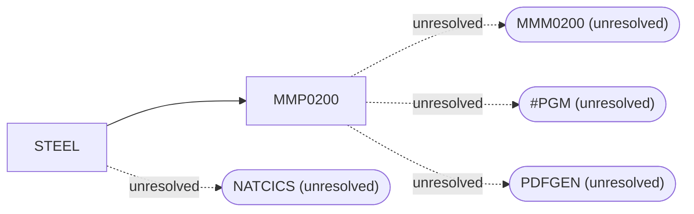

# Call graph — component-4

```mermaid
graph LR
    n_MILLPROD_MMP0200_natural_591e11["MMP0200"]
    n_MMM0200_d74c33(["MMM0200 (unresolved)"])
    n_MILLPROD_MMP0200_natural_591e11 -.->|unresolved| n_MMM0200_d74c33
    n__PGM_3c367c(["#PGM (unresolved)"])
    n_MILLPROD_MMP0200_natural_591e11 -.->|unresolved| n__PGM_3c367c
    n_PDFGEN_d9cc91(["PDFGEN (unresolved)"])
    n_MILLPROD_MMP0200_natural_591e11 -.->|unresolved| n_PDFGEN_d9cc91
    n_unknown_STEEL_cics_csd_04f445["STEEL"]
    n_NATCICS_1a3061(["NATCICS (unresolved)"])
    n_unknown_STEEL_cics_csd_04f445 -.->|unresolved| n_NATCICS_1a3061
    n_unknown_STEEL_cics_csd_04f445 --> n_MILLPROD_MMP0200_natural_591e11
```
