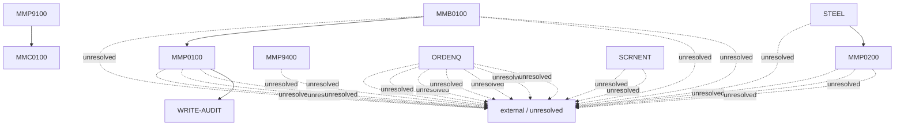

# Call graph

```mermaid
graph TD
    n_MMB0100_e0da8b["MMB0100"]
    n_MMB0100_e0da8b -.->|unresolved| unresolved_sink
    n_MMP0100_8cf9a3["MMP0100"]
    n_MMB0100_e0da8b --> n_MMP0100_8cf9a3
    n_MMB0100_e0da8b -.->|unresolved| unresolved_sink
    n_MMB0100_e0da8b -.->|unresolved| unresolved_sink
    n_MMP0100_8cf9a3 -.->|unresolved| unresolved_sink
    n_MMP0100_8cf9a3 -.->|unresolved| unresolved_sink
    n_MMP0100_8cf9a3 -.->|unresolved| unresolved_sink
    n_WRITE_AUDIT_1d9441["WRITE-AUDIT"]
    n_MMP0100_8cf9a3 --> n_WRITE_AUDIT_1d9441
    n_MMP0200_1f64a3["MMP0200"]
    n_MMP0200_1f64a3 -.->|unresolved| unresolved_sink
    n_MMP0200_1f64a3 -.->|unresolved| unresolved_sink
    n_MMP0200_1f64a3 -.->|unresolved| unresolved_sink
    n_MMP9100_de93b7["MMP9100"]
    n_MMC0100_3c03f8["MMC0100"]
    n_MMP9100_de93b7 --> n_MMC0100_3c03f8
    n_MMP9400_a303f1["MMP9400"]
    n_MMP9400_a303f1 -.->|unresolved| unresolved_sink
    n_ORDENQ_64c39a["ORDENQ"]
    n_ORDENQ_64c39a -.->|unresolved| unresolved_sink
    n_ORDENQ_64c39a -.->|unresolved| unresolved_sink
    n_ORDENQ_64c39a -.->|unresolved| unresolved_sink
    n_ORDENQ_64c39a -.->|unresolved| unresolved_sink
    n_ORDENQ_64c39a -.->|unresolved| unresolved_sink
    n_ORDENQ_64c39a -.->|unresolved| unresolved_sink
    n_ORDENQ_64c39a -.->|unresolved| unresolved_sink
    n_SCRNENT_fb658a["SCRNENT"]
    n_SCRNENT_fb658a -.->|unresolved| unresolved_sink
    n_SCRNENT_fb658a -.->|unresolved| unresolved_sink
    n_STEEL_2762ee["STEEL"]
    n_STEEL_2762ee -.->|unresolved| unresolved_sink
    n_STEEL_2762ee --> n_MMP0200_1f64a3
    unresolved_sink["external / unresolved"]
```
