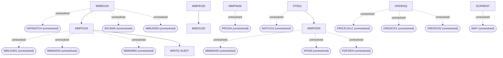

# Call graph

```mermaid
graph TD
    n___member_id_22_c96e21["MMB0100"]
    n_NATBATCH_1ec14e(["NATBATCH (unresolved)"])
    n___member_id_22_c96e21 -.->|unresolved| n_NATBATCH_1ec14e
    n___member_id_3_ef269e["MMP0100"]
    n___member_id_22_c96e21 --> n___member_id_3_ef269e
    n_IDCAMS_143221(["IDCAMS (unresolved)"])
    n___member_id_22_c96e21 -.->|unresolved| n_IDCAMS_143221
    n_MMU0300_5a0cc4(["MMU0300 (unresolved)"])
    n___member_id_22_c96e21 -.->|unresolved| n_MMU0300_5a0cc4
    n_MMLDA01_0d625b(["MMLDA01 (unresolved)"])
    n___member_id_3_ef269e -.->|unresolved| n_MMLDA01_0d625b
    n_MMN0250_191285(["MMN0250 (unresolved)"])
    n___member_id_3_ef269e -.->|unresolved| n_MMN0250_191285
    n_MMN0900_91c85d(["MMN0900 (unresolved)"])
    n___member_id_3_ef269e -.->|unresolved| n_MMN0900_91c85d
    n_WRITE_AUDIT_1d9441["WRITE-AUDIT"]
    n___member_id_3_ef269e --> n_WRITE_AUDIT_1d9441
    n___member_id_4_a9a2bb["MMP0200"]
    n_MMM0200_d74c33(["MMM0200 (unresolved)"])
    n___member_id_4_a9a2bb -.->|unresolved| n_MMM0200_d74c33
    n__PGM_3c367c(["#PGM (unresolved)"])
    n___member_id_4_a9a2bb -.->|unresolved| n__PGM_3c367c
    n_PDFGEN_d9cc91(["PDFGEN (unresolved)"])
    n___member_id_4_a9a2bb -.->|unresolved| n_PDFGEN_d9cc91
    n___member_id_6_a5431c["MMP9100"]
    n___member_id_1_a1b47e["MMC0100"]
    n___member_id_6_a5431c --> n___member_id_1_a1b47e
    n___member_id_9_ded093["MMP9400"]
    n_PROGA_5dc263(["PROGA (unresolved)"])
    n___member_id_9_ded093 -.->|unresolved| n_PROGA_5dc263
    n___member_id_18_54d130["ORDENQ"]
    n_PRICECALC_388507(["PRICECALC (unresolved)"])
    n___member_id_18_54d130 -.->|unresolved| n_PRICECALC_388507
    n_ORDSCR1_79daf7(["ORDSCR1 (unresolved)"])
    n___member_id_18_54d130 -.->|unresolved| n_ORDSCR1_79daf7
    n_ORDSCR2_a3c2bc(["ORDSCR2 (unresolved)"])
    n___member_id_18_54d130 -.->|unresolved| n_ORDSCR2_a3c2bc
    n___member_id_19_49bb9c["SCRNENT"]
    n_MAP_5af1a3(["MAP (unresolved)"])
    n___member_id_19_49bb9c -.->|unresolved| n_MAP_5af1a3
    n___member_id_23_809c70["STEEL"]
    n_NATCICS_1a3061(["NATCICS (unresolved)"])
    n___member_id_23_809c70 -.->|unresolved| n_NATCICS_1a3061
    n___member_id_23_809c70 --> n___member_id_4_a9a2bb
```
