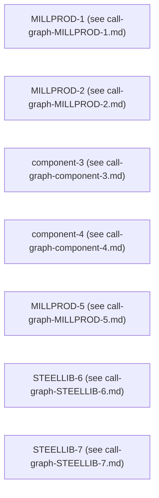

# Call graph

The call graph splits into multiple independent components -- one node per component below; see the standalone file for each component's full graph.

```mermaid
graph LR
    n_MILLPROD_1_795d31["MILLPROD-1 (see call-graph-MILLPROD-1.md)"]
    n_MILLPROD_2_33e032["MILLPROD-2 (see call-graph-MILLPROD-2.md)"]
    n_component_3_e0f188["component-3 (see call-graph-component-3.md)"]
    n_component_4_712094["component-4 (see call-graph-component-4.md)"]
    n_MILLPROD_5_c3f3be["MILLPROD-5 (see call-graph-MILLPROD-5.md)"]
    n_STEELLIB_6_0c2b04["STEELLIB-6 (see call-graph-STEELLIB-6.md)"]
    n_STEELLIB_7_c98a16["STEELLIB-7 (see call-graph-STEELLIB-7.md)"]
```
