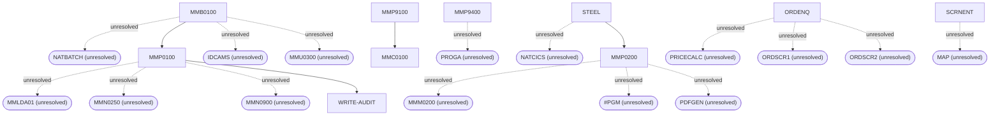

# Call graph

```mermaid
graph TD
    n_unknown_MMB0100_jcl_92d85c["MMB0100"]
    n_NATBATCH_1ec14e(["NATBATCH (unresolved)"])
    n_unknown_MMB0100_jcl_92d85c -.->|unresolved| n_NATBATCH_1ec14e
    n_MILLPROD_MMP0100_natural_6fdf53["MMP0100"]
    n_unknown_MMB0100_jcl_92d85c --> n_MILLPROD_MMP0100_natural_6fdf53
    n_IDCAMS_143221(["IDCAMS (unresolved)"])
    n_unknown_MMB0100_jcl_92d85c -.->|unresolved| n_IDCAMS_143221
    n_MMU0300_5a0cc4(["MMU0300 (unresolved)"])
    n_unknown_MMB0100_jcl_92d85c -.->|unresolved| n_MMU0300_5a0cc4
    n_MMLDA01_0d625b(["MMLDA01 (unresolved)"])
    n_MILLPROD_MMP0100_natural_6fdf53 -.->|unresolved| n_MMLDA01_0d625b
    n_MMN0250_191285(["MMN0250 (unresolved)"])
    n_MILLPROD_MMP0100_natural_6fdf53 -.->|unresolved| n_MMN0250_191285
    n_MMN0900_91c85d(["MMN0900 (unresolved)"])
    n_MILLPROD_MMP0100_natural_6fdf53 -.->|unresolved| n_MMN0900_91c85d
    n_WRITE_AUDIT_1d9441["WRITE-AUDIT"]
    n_MILLPROD_MMP0100_natural_6fdf53 --> n_WRITE_AUDIT_1d9441
    n_MILLPROD_MMP0200_natural_591e11["MMP0200"]
    n_MMM0200_d74c33(["MMM0200 (unresolved)"])
    n_MILLPROD_MMP0200_natural_591e11 -.->|unresolved| n_MMM0200_d74c33
    n__PGM_3c367c(["#PGM (unresolved)"])
    n_MILLPROD_MMP0200_natural_591e11 -.->|unresolved| n__PGM_3c367c
    n_PDFGEN_d9cc91(["PDFGEN (unresolved)"])
    n_MILLPROD_MMP0200_natural_591e11 -.->|unresolved| n_PDFGEN_d9cc91
    n_MILLPROD_MMP9100_natural_32c783["MMP9100"]
    n_MILLPROD_MMC0100_natural_50939d["MMC0100"]
    n_MILLPROD_MMP9100_natural_32c783 --> n_MILLPROD_MMC0100_natural_50939d
    n_MILLPROD_MMP9400_natural_88c0b9["MMP9400"]
    n_PROGA_5dc263(["PROGA (unresolved)"])
    n_MILLPROD_MMP9400_natural_88c0b9 -.->|unresolved| n_PROGA_5dc263
    n_STEELLIB_ORDENQ_mantis_a7879c["ORDENQ"]
    n_PRICECALC_388507(["PRICECALC (unresolved)"])
    n_STEELLIB_ORDENQ_mantis_a7879c -.->|unresolved| n_PRICECALC_388507
    n_ORDSCR1_79daf7(["ORDSCR1 (unresolved)"])
    n_STEELLIB_ORDENQ_mantis_a7879c -.->|unresolved| n_ORDSCR1_79daf7
    n_ORDSCR2_a3c2bc(["ORDSCR2 (unresolved)"])
    n_STEELLIB_ORDENQ_mantis_a7879c -.->|unresolved| n_ORDSCR2_a3c2bc
    n_STEELLIB_SCRNENT_mantis_38c50a["SCRNENT"]
    n_MAP_5af1a3(["MAP (unresolved)"])
    n_STEELLIB_SCRNENT_mantis_38c50a -.->|unresolved| n_MAP_5af1a3
    n_unknown_STEEL_cics_csd_04f445["STEEL"]
    n_NATCICS_1a3061(["NATCICS (unresolved)"])
    n_unknown_STEEL_cics_csd_04f445 -.->|unresolved| n_NATCICS_1a3061
    n_unknown_STEEL_cics_csd_04f445 --> n_MILLPROD_MMP0200_natural_591e11
```
