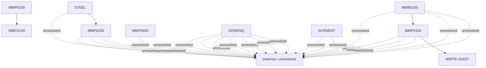

# Call graph

```mermaid
graph TD
    n_MMP0100["MMP0100"]
    n_MMP0100 -.->|unresolved| unresolved_sink
    n_MMP0100 -.->|unresolved| unresolved_sink
    n_MMP0100 -.->|unresolved| unresolved_sink
    n_WRITE_AUDIT["WRITE-AUDIT"]
    n_MMP0100 --> n_WRITE_AUDIT
    n_MMP0200["MMP0200"]
    n_MMP0200 -.->|unresolved| unresolved_sink
    n_MMP0200 -.->|unresolved| unresolved_sink
    n_MMP0200 -.->|unresolved| unresolved_sink
    n_MMP9100["MMP9100"]
    n_MMC0100["MMC0100"]
    n_MMP9100 --> n_MMC0100
    n_MMP9400["MMP9400"]
    n_MMP9400 -.->|unresolved| unresolved_sink
    n_ORDENQ["ORDENQ"]
    n_ORDENQ -.->|unresolved| unresolved_sink
    n_ORDENQ -.->|unresolved| unresolved_sink
    n_ORDENQ -.->|unresolved| unresolved_sink
    n_ORDENQ -.->|unresolved| unresolved_sink
    n_ORDENQ -.->|unresolved| unresolved_sink
    n_ORDENQ -.->|unresolved| unresolved_sink
    n_ORDENQ -.->|unresolved| unresolved_sink
    n_SCRNENT["SCRNENT"]
    n_SCRNENT -.->|unresolved| unresolved_sink
    n_SCRNENT -.->|unresolved| unresolved_sink
    n_MMB0100["MMB0100"]
    n_MMB0100 -.->|unresolved| unresolved_sink
    n_MMB0100 --> n_MMP0100
    n_MMB0100 -.->|unresolved| unresolved_sink
    n_MMB0100 -.->|unresolved| unresolved_sink
    n_STEEL["STEEL"]
    n_STEEL -.->|unresolved| unresolved_sink
    n_STEEL --> n_MMP0200
    unresolved_sink["external / unresolved"]
```
