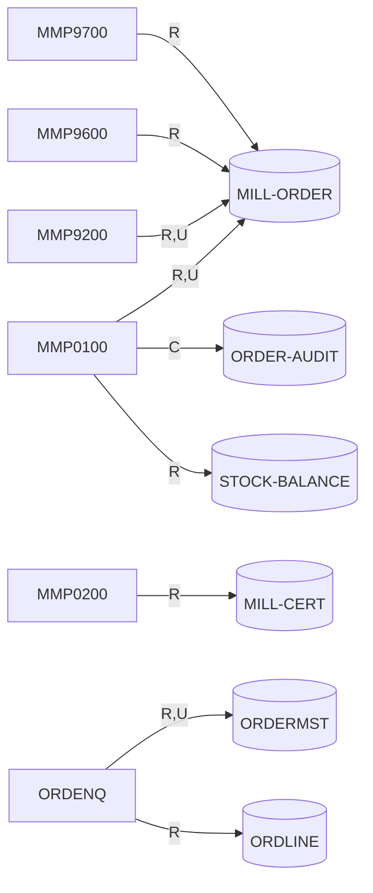

# Data-flow diagram

Module-to-entity read/write edges, derived from every recorded data-access statement. Regenerate with `mfdoc data-flow` after any source change; do not hand-edit.

```mermaid
graph LR
    n_MMP0100["MMP0100"]
    n_MILL_ORDER[("MILL-ORDER")]
    n_MMP0100 -->|R,U| n_MILL_ORDER
    n_ORDER_AUDIT[("ORDER-AUDIT")]
    n_MMP0100 -->|C| n_ORDER_AUDIT
    n_STOCK_BALANCE[("STOCK-BALANCE")]
    n_MMP0100 -->|R| n_STOCK_BALANCE
    n_MMP0200["MMP0200"]
    n_MILL_CERT[("MILL-CERT")]
    n_MMP0200 -->|R| n_MILL_CERT
    n_MMP9200["MMP9200"]
    n_MMP9200 -->|R,U| n_MILL_ORDER
    n_MMP9600["MMP9600"]
    n_MMP9600 -->|R| n_MILL_ORDER
    n_MMP9700["MMP9700"]
    n_MMP9700 -->|R| n_MILL_ORDER
    n_ORDENQ["ORDENQ"]
    n_ORDERMST[("ORDERMST")]
    n_ORDENQ -->|R,U| n_ORDERMST
    n_ORDLINE[("ORDLINE")]
    n_ORDENQ -->|R| n_ORDLINE
```

